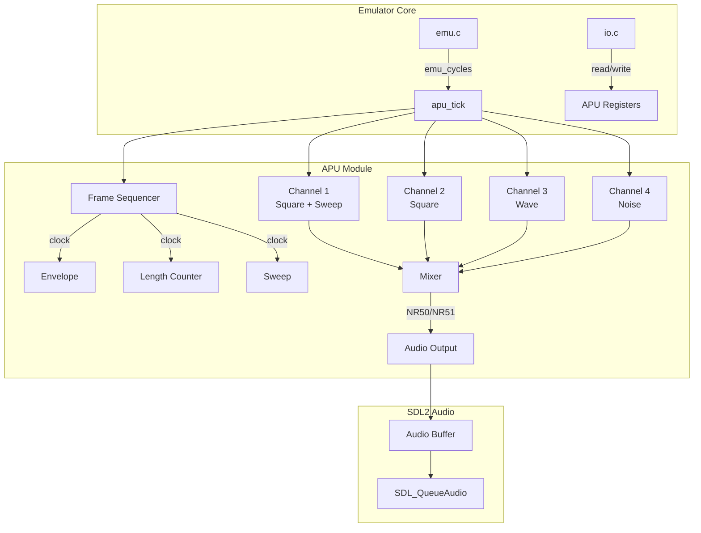

# Design Document: Game Boy APU

## Overview

本設計ドキュメントは、Game BoyエミュレータにおけるAPU（Audio Processing Unit）の技術的な実装設計を定義します。APUは4つの独立したサウンドチャンネルを持ち、それぞれが異なる波形生成方式を使用します。実装は既存のエミュレータアーキテクチャ（タイマー、I/O、バス）と同様のパターンに従い、モジュール性と保守性を確保します。

### 設計方針

1. **既存パターンの踏襲**: timer.c/timer.hと同様のコンテキスト構造体パターンを使用
2. **モジュール分離**: APUコア、各チャンネル、オーディオ出力を論理的に分離
3. **正確なタイミング**: T-cycle単位での処理によりハードウェア動作を忠実に再現
4. **効率的なサンプリング**: ダウンサンプリングによりCPU負荷を最小化

## Architecture



### ファイル構成

```
emu/
├── include/
│   └── apu.h          # APU公開インターフェース
└── lib/
    └── apu.c          # APU実装
```

## Components and Interfaces

### APU公開インターフェース (apu.h)

```c
#pragma once
#include <common.h>

// APU初期化・終了
void apu_init();

// T-cycle単位でAPUを進める
void apu_tick();

// レジスタアクセス
u8 apu_read(u16 address);
void apu_write(u16 address, u8 value);

// SDL2オーディオ初期化（ui_initから呼び出し）
void apu_audio_init();
void apu_audio_shutdown();
```

### 内部構造体

#### チャンネル共通構造体

```c
typedef struct {
    bool enabled;           // チャンネル有効フラグ
    bool dac_enabled;       // DAC有効フラグ
    
    // 長さカウンター
    u16 length_counter;
    bool length_enabled;
    
    // エンベロープ
    u8 volume;
    u8 envelope_initial;
    bool envelope_direction; // true=増加, false=減少
    u8 envelope_period;
    u8 envelope_timer;
    
    // 周波数/タイマー
    u16 frequency;
    u16 timer;
    
    // 出力
    u8 output;
} channel_common_t;
```

#### チャンネル1構造体（スイープ付き矩形波）

```c
typedef struct {
    channel_common_t common;
    
    // デューティサイクル
    u8 duty;                // 0-3 (12.5%, 25%, 50%, 75%)
    u8 duty_position;       // 0-7
    
    // スイープ
    u8 sweep_period;
    bool sweep_direction;   // true=減少, false=増加
    u8 sweep_shift;
    u8 sweep_timer;
    u16 sweep_shadow;
    bool sweep_enabled;
} channel1_t;
```

#### チャンネル2構造体（矩形波）

```c
typedef struct {
    channel_common_t common;
    
    // デューティサイクル
    u8 duty;
    u8 duty_position;
} channel2_t;
```

#### チャンネル3構造体（波形メモリ）

```c
typedef struct {
    channel_common_t common;
    
    // 波形
    u8 wave_ram[16];        // 32サンプル（4bit x 2 per byte）
    u8 wave_position;       // 0-31
    u8 volume_shift;        // 0=mute, 1=100%, 2=50%, 3=25%
} channel3_t;
```

#### チャンネル4構造体（ノイズ）

```c
typedef struct {
    channel_common_t common;
    
    // LFSR
    u16 lfsr;               // 15-bit LFSR
    bool width_mode;        // true=7-bit, false=15-bit
    u8 clock_shift;
    u8 divisor_code;
} channel4_t;
```

#### APUコンテキスト

```c
typedef struct {
    // チャンネル
    channel1_t ch1;
    channel2_t ch2;
    channel3_t ch3;
    channel4_t ch4;
    
    // フレームシーケンサー
    u16 frame_sequencer_timer;  // 8192でリセット
    u8 frame_sequencer_step;    // 0-7
    
    // マスターコントロール
    bool enabled;               // NR52 bit 7
    u8 nr50;                    // マスターボリューム
    u8 nr51;                    // パンニング
    
    // オーディオ出力
    u32 sample_timer;           // ダウンサンプリング用
    s16 *audio_buffer;
    u32 buffer_position;
    u32 buffer_size;
} apu_context;
```

## Data Models

### レジスタマッピング

| アドレス | レジスタ | 説明 |
|---------|---------|------|
| 0xFF10 | NR10 | CH1 スイープ |
| 0xFF11 | NR11 | CH1 デューティ/長さ |
| 0xFF12 | NR12 | CH1 エンベロープ |
| 0xFF13 | NR13 | CH1 周波数下位 |
| 0xFF14 | NR14 | CH1 トリガー/周波数上位 |
| 0xFF16 | NR21 | CH2 デューティ/長さ |
| 0xFF17 | NR22 | CH2 エンベロープ |
| 0xFF18 | NR23 | CH2 周波数下位 |
| 0xFF19 | NR24 | CH2 トリガー/周波数上位 |
| 0xFF1A | NR30 | CH3 DAC有効 |
| 0xFF1B | NR31 | CH3 長さ |
| 0xFF1C | NR32 | CH3 ボリューム |
| 0xFF1D | NR33 | CH3 周波数下位 |
| 0xFF1E | NR34 | CH3 トリガー/周波数上位 |
| 0xFF20 | NR41 | CH4 長さ |
| 0xFF21 | NR42 | CH4 エンベロープ |
| 0xFF22 | NR43 | CH4 ポリノミアル |
| 0xFF23 | NR44 | CH4 トリガー |
| 0xFF24 | NR50 | マスターボリューム |
| 0xFF25 | NR51 | パンニング |
| 0xFF26 | NR52 | APU有効/ステータス |
| 0xFF30-0xFF3F | Wave RAM | 波形データ |

### レジスタ読み取りORマスク

書き込み専用ビットは読み取り時に1を返す：

```c
static const u8 read_masks[] = {
    0x80, // NR10
    0x3F, // NR11
    0x00, // NR12
    0xFF, // NR13
    0xBF, // NR14
    0xFF, // NR15 (unused)
    0x3F, // NR21
    0x00, // NR22
    0xFF, // NR23
    0xBF, // NR24
    0x7F, // NR30
    0xFF, // NR31
    0x9F, // NR32
    0xFF, // NR33
    0xBF, // NR34
    0xFF, // NR35 (unused)
    0xFF, // NR41
    0x00, // NR42
    0x00, // NR43
    0xBF, // NR44
    0x00, // NR50
    0x00, // NR51
    0x70, // NR52
};
```

### デューティサイクル波形

```c
static const u8 duty_table[4][8] = {
    {0, 0, 0, 0, 0, 0, 0, 1}, // 12.5%
    {1, 0, 0, 0, 0, 0, 0, 1}, // 25%
    {1, 0, 0, 0, 0, 1, 1, 1}, // 50%
    {0, 1, 1, 1, 1, 1, 1, 0}, // 75%
};
```

### ノイズ除数テーブル

```c
static const u8 divisor_table[] = {8, 16, 32, 48, 64, 80, 96, 112};
```

## Correctness Properties

*正確性プロパティは、システムのすべての有効な実行において真であるべき特性や動作です。プロパティは人間が読める仕様と機械検証可能な正確性保証の橋渡しとなります。*


### Property 1: レジスタ書き込み・読み取りラウンドトリップ

*For any* APUレジスタアドレス（0xFF10-0xFF26）と有効な値について、書き込んだ後に読み取ると、読み取りマスクを適用した値が返される。

**Validates: Requirements 9.1, 9.2, 9.6**

### Property 2: Wave RAM ラウンドトリップ

*For any* Wave RAMアドレス（0xFF30-0xFF3F）と任意のバイト値について、書き込んだ後に読み取ると、同じ値が返される（チャンネル3が非アクティブの場合）。

**Validates: Requirements 5.8, 9.3, 9.4**

### Property 3: フレームシーケンサータイミング

*For any* 初期状態から、8192回のapu_tick呼び出し後、フレームシーケンサーのステップが1増加する。また、ステップは0-7の範囲で循環する。

**Validates: Requirements 2.1, 2.5**

### Property 4: 長さカウンター動作

*For any* 有効な長さカウンター値と有効化されたチャンネルについて、フレームシーケンサーのステップ0,2,4,6でカウンターが減少し、0に達するとチャンネルが無効化される。長さが無効の場合、カウンターは変化しない。

**Validates: Requirements 8.1, 8.2, 8.3, 8.4**

### Property 5: エンベロープ動作

*For any* 有効なエンベロープ設定（初期ボリューム、方向、周期）について、フレームシーケンサーのステップ7でボリュームが正しく増減する。ボリュームは0-15の範囲にクランプされる。

**Validates: Requirements 7.1, 7.2, 7.3, 7.4, 7.5**

### Property 6: LFSR状態遷移

*For any* LFSR初期状態について、クロック時にビット0とビット1のXOR結果が右シフト後のビット14（および7ビットモードではビット6）に設定される。

**Validates: Requirements 6.6, 6.7**

### Property 7: デューティサイクル出力

*For any* デューティサイクル設定（0-3）とデューティ位置（0-7）について、矩形波チャンネルの出力はデューティテーブルに従った値（0または1）にボリュームを乗じた値となる。

**Validates: Requirements 3.7, 4.6**

### Property 8: スイープ周波数計算

*For any* 有効なスイープ設定（周期、方向、シフト）と現在の周波数について、スイープクロック時に新しい周波数が正しく計算される。計算結果が2047を超える場合、チャンネルは無効化される。

**Validates: Requirements 3.8, 3.9**

### Property 9: APU無効時の動作

*For any* APUが無効（NR52ビット7=0）の状態で、チャンネルレジスタへの書き込みは無視され、オーディオ出力は常に0となる。

**Validates: Requirements 1.4**

### Property 10: チャンネルミキシング

*For any* NR51パンニング設定とNR50マスターボリューム設定について、有効なチャンネルの出力は設定に従って左右チャンネルにミキシングされる。

**Validates: Requirements 10.1, 10.2, 10.3, 10.4**

## Error Handling

### 無効なアドレスアクセス

- 未使用アドレス（0xFF15, 0xFF1F, 0xFF27-0xFF2F）への読み取りは0xFFを返す
- 未使用アドレスへの書き込みは無視される

### SDL2オーディオエラー

- SDL_OpenAudioDevice失敗時はエラーログを出力し、オーディオなしで継続
- オーディオバッファキュー失敗時は警告を出力し、サンプルを破棄

### オーバーフロー保護

- スイープ周波数計算時のオーバーフローチェック
- ボリューム値の0-15範囲クランプ
- 長さカウンターのアンダーフロー保護

## Testing Strategy

### ユニットテスト

Checkフレームワークを使用して以下をテスト：

1. **初期化テスト**: apu_init後のレジスタデフォルト値
2. **レジスタI/Oテスト**: 各レジスタの読み書き
3. **Wave RAMテスト**: 波形データの読み書き
4. **LFSRテスト**: 特定の初期状態からの状態遷移

### プロパティベーステスト

Checkフレームワークのループテストを使用：

1. **レジスタラウンドトリップ**: ランダムな値での書き込み・読み取り検証
2. **フレームシーケンサー**: 複数サイクルでのタイミング検証
3. **エンベロープ**: 様々な設定での動作検証
4. **LFSR**: 複数ステップでの状態遷移検証

### 統合テスト

- 既存のROMテスト（cpu_instrs.gb等）でのオーディオ出力確認
- 手動でのオーディオ品質確認

### テスト設定

- 各プロパティテストは最低100回の反復
- テストタグ形式: **Feature: gameboy-apu, Property N: {property_text}**
